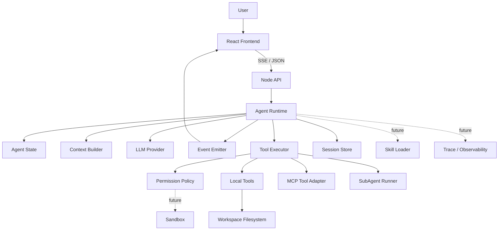
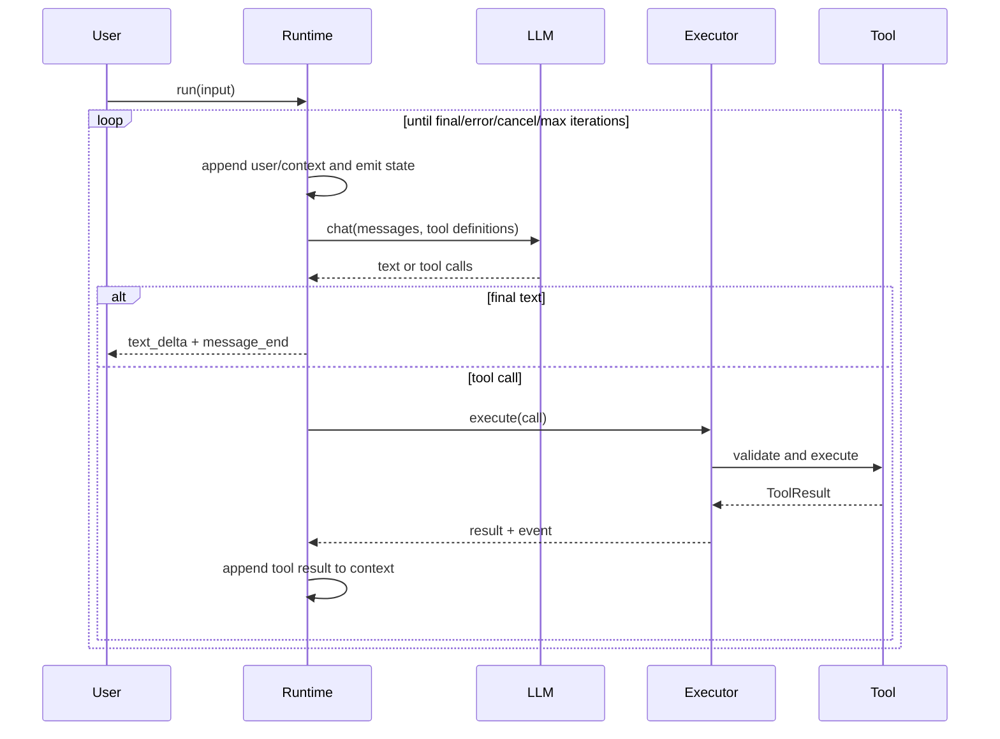
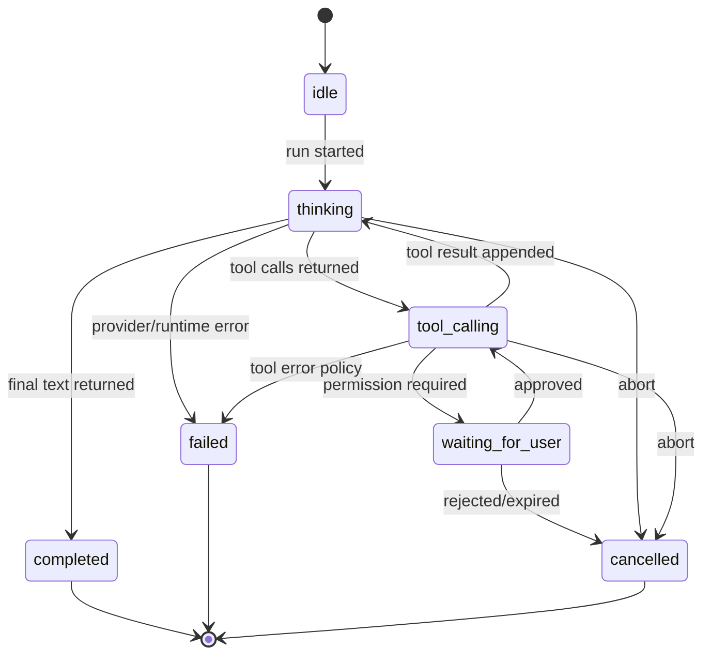

# Mini Agent Runtime 架构设计

## 1. 总体架构



核心关系是：Frontend 只负责交互和渲染，API 负责传输适配，Runtime 负责决策循环，Tool Executor 负责执行边界，Context Builder 负责把消息和工具结果变成下一次 LLM 输入。

## 2. 分层职责

### Frontend

React 客户端提交用户输入，消费 SSE Agent Event，渲染文本、工具调用、工具结果、权限请求、错误和最终状态。它不执行工具、不决定权限，也不推断缺失事件。

### Backend API

Node.js HTTP 层负责会话入口、请求校验、SSE headers、断开检测和 Runtime 生命周期绑定。API 不包含 Agent 决策逻辑。

### Agent Runtime

Runtime 持有一次 Run 的状态，执行“组装上下文 → 调用 LLM → 解析 Decision → 执行工具或结束 → 回填结果”的循环，并强制最大迭代、取消和错误收敛。

### LLM Provider

把内部 Message/ToolDefinition 映射到具体模型协议，再把文本、tool calls 和 finish reason 归一化为 `LLMResponse`。Provider 不执行工具、不改变 AgentState。

### Tool System

Registry 保存可用工具及 schema；Executor 校验名称和输入、应用权限策略、执行工具、归一化结果并发出事件。工具自身只关注业务能力和 `ToolContext`。

### MCP

MCP Client 连接外部 MCP Server，把远端工具发现结果转换为内部 ToolDefinition，把调用转换为 ToolResult。MCP Tool 与 Local Tool 在 Runtime 中共享 Tool 接口，但传输和故障边界独立。

### Skill

Skill Loader 读取版本化 `SKILL.md` 元数据和指令；Skill Selector 根据任务选择有限 Skill，并作为 Context 的受控部分注入。Skill 不直接执行工具，也不能绕过权限。

### SubAgent

SubAgent Runner 创建隔离的子上下文和预算，复用受限 Runtime 能力，返回结构化结果。父 Agent 只能看到显式汇总结果，不共享可变消息数组。

### Session 与 Storage

Session 保存消息、工具历史、状态快照和事件游标。V1 可用进程内实现，但接口必须允许替换持久化实现；Resume 只能从一致快照恢复，不重复执行已确认的工具调用。

### Observability

每次 Run 生成 trace/run/turn/tool-call 标识，记录状态变化、耗时、Provider 错误和工具结果摘要。敏感输入和完整文件内容默认不写入日志。

## 3. Agent Loop



结束条件按优先级为：取消、不可恢复错误、达到最大迭代次数、模型返回最终文本。若同一响应同时有文本和工具调用，V1 只接受协议规定的组合（文本作为可选思考展示，工具调用继续循环），最终回答必须以模型明确结束为准。

## 4. 状态机



V1 只会实际使用 `idle/thinking/tool_calling/completed/failed/cancelled`；`waiting_for_user` 在 Phase 4 启用，保留状态是为了稳定事件和 Session 模型。

## 5. 数据流与边界

1. 用户输入进入 API 后创建 Run Context，不直接拼接到系统级指令。
2. Context Builder 组合 system instruction、历史消息、工具结果、预算信息和可选 Skill。
3. LLM 只返回 Decision；Runtime 负责验证 Decision，不能把模型输出当作执行权限。
4. Executor 通过 Registry 查找工具、校验 schema 和 workspace 边界，再执行。
5. Tool Result 必须包含成功/失败、可展示内容和机器可读元数据；随后以 `tool` Message 回填。
6. Event Emitter 发布不可变事件；SSE 只做传输，不改变事件语义。

## 6. 依赖方向

```text
domain types
  ├── state/context
  ├── llm port
  ├── tool port
  └── event protocol
       └── agent runtime
            ├── API/SSE adapter
            ├── local tool adapters
            ├── MCP adapter
            ├── skill adapter
            └── subagent adapter
```

低层端口不依赖 HTTP、React 或具体 Provider。扩展能力依赖 Agent Core 和 Tool System，不能反向改变 Core 的基本语义。

## 7. 安全边界

- Workspace root 是所有本地文件工具的硬边界，路径必须 canonicalize 后再检查；
- V1 仅注册只读工具；写入、执行命令必须由 Permission Policy 显式放行；
- LLM 产生的工具名和参数一律视为不可信输入；
- Tool、MCP、SubAgent 都有独立超时和结果大小限制；
- SSE 断线不等于 Run 成功或失败，状态由 Runtime/Session 决定；
- 日志默认脱敏，不能把密钥、完整文件或用户隐私写入 Trace。

## 8. 演进原则

先完成稳定的 Core/Tool/Event 语义，再增加外部传输和执行来源。每个阶段必须保留向前兼容的事件 `version`、明确错误码和可替换端口，避免为未来能力预先引入复杂工厂层。
