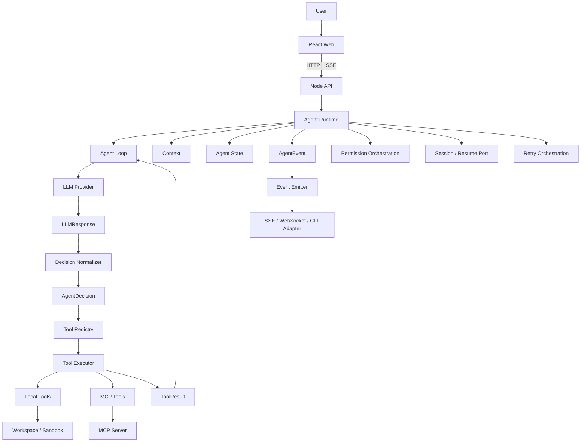
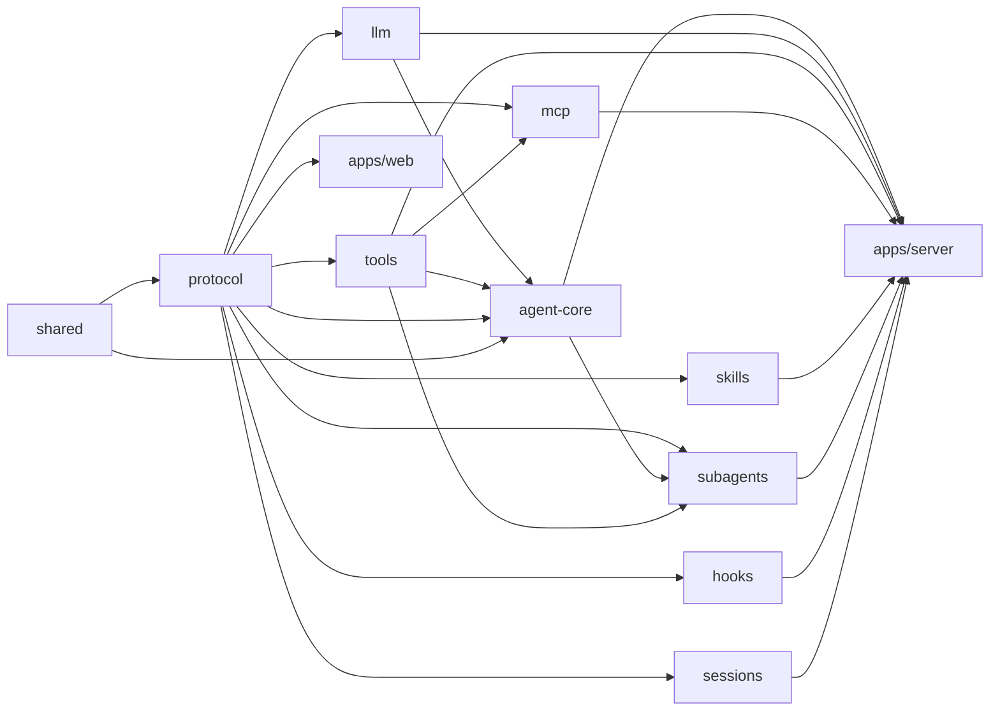
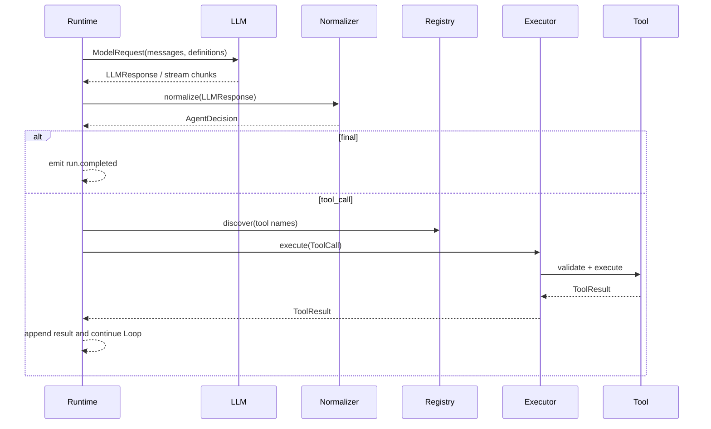

# Mini Agent Runtime 目标架构

## 1. 架构定位

Mini Agent Runtime 是一个 Mini Agent Runtime / Agent Application Framework。当前文档描述最终目标架构，不代表所有模块现在同时实现。实际开发必须严格按照 `specs/` 中的 Phase 和 Task 增量交付。

## 2. 目标目录结构

```text
mini-agent/
├── apps/
│   ├── web/                         # React 前端
│   │   └── src/
│   │       ├── components/
│   │       ├── features/            # chat / sessions / tools / trace
│   │       ├── hooks/
│   │       ├── stores/
│   │       ├── api/
│   │       └── main.tsx
│   └── server/                      # Node API + composition root
│       └── src/
│           ├── routes/
│           ├── controllers/
│           ├── services/
│           ├── agents/              # 具体 Agent Definition / Application
│           └── index.ts
├── packages/
│   ├── agent-core/                  # Agent Runtime 核心
│   │   └── src/
│   │       ├── agent/               # agent.ts / agent-definition.ts / agent-loop.ts / agent-state.ts
│   │       ├── decision/            # decision.ts / normalizer.ts
│   │       ├── context/             # context-builder.ts / message-manager.ts
│   │       ├── events/              # agent-event.ts / event-emitter.ts
│   │       ├── permissions/         # permission-policy.ts / permission-manager.ts
│   │       └── index.ts
│   ├── llm/                         # LLM Provider 抽象
│   │   └── src/                     # provider.ts / types.ts / adapters
│   ├── tools/                       # Tool System
│   │   └── src/
│   │       ├── registry/
│   │       ├── executor/
│   │       ├── builtin/             # read/list first; write/edit/search/bash later
│   │       ├── types.ts
│   │       └── index.ts
│   ├── mcp/                         # MCP Client / Adapter / Discovery
│   │   └── src/                     # client/ adapter/ discovery/ types.ts
│   ├── skills/                      # SKILL.md Loader / Selector / Runtime
│   │   └── src/                     # loader.ts / selector.ts / runtime.ts / types.ts
│   ├── subagents/                   # Child Runtime / Delegation
│   │   └── src/                     # runner.ts / manager.ts / types.ts
│   ├── hooks/                       # Lifecycle Hook contracts and runner
│   │   └── src/                     # hook-manager.ts / types.ts / builtin/
│   ├── sessions/                    # Session / Run / Turn / Snapshot / Resume
│   │   └── src/                     # session-manager.ts / snapshot.ts / persistence.ts / types.ts
│   ├── protocol/                    # Message / Event / Tool Call / Error / Schema
│   │   └── src/                     # messages.ts / events.ts / tool-calls.ts / errors.ts / schemas.ts
│   └── shared/                      # IDs / Clock / Result / low-level utilities
│       └── src/
├── skills/                          # Project/user Skill files, not code package
├── specs/                           # Phase specifications
├── docs/                            # Product and architecture documents
├── tests/                           # Cross-package integration/acceptance tests
├── workspace/                       # Local fixture and execution boundary
├── AGENTS.md
├── README.md
├── package.json
├── pnpm-workspace.yaml
└── tsconfig.json
```

这是目标结构，不要求当前阶段创建空目录或空模块。`Phase 0` 只建立包边界和工具链；具体包在对应 Phase 进入实现。

## 3. 核心运行关系



关键规则：LLM 负责决策，不负责执行；`LLMResponse` 必须先经过 `Decision Normalizer` 才能成为内部 `AgentDecision`；Agent Runtime 通过 `Tool Registry` 和 `Tool Executor` 执行工具；SSE 只传输 `AgentEvent`，不能定义或改变事件语义。

## 4. 模块职责

### `packages/agent-core`

整个 Runtime 的核心，负责 Agent、Agent Loop、Agent State、`decision/` 中的 AgentDecision 与 Normalizer、Context、AgentEvent 发布、Cancellation，以及 Permission、Retry、Session、Hooks 的编排。`decision/normalizer.ts` 把 `LLMResponse` 转换为内部 `AgentDecision`；`events/` 负责发布事件；`permissions/` 负责 Phase 4 的策略编排。它不依赖 React、HTTP、SSE、具体 LLM SDK 或具体数据库。

具体 Permission Policy、Session Store、Retry Policy、Hook Runner 可以由其他包实现并通过端口注入；这不改变 Agent Core 负责 orchestration 的职责。

### `packages/llm`

负责 `LLMProvider`、Model Request/Response、OpenAI/Anthropic 等 Provider Adapter 和模型流式响应。Provider 只产生统一的 `LLMResponse` 或模型增量，绝不执行 Tool，也不拥有 Agent Decision Normalizer；Normalizer 属于 `agent-core/decision`。

### `packages/tools`

负责 Tool 类型、Tool Registry、Tool Executor、内置工具、超时、错误归一化、workspace 边界和后续 Sandbox Adapter。目标内置工具包括 `read-file`、`write-file`、`edit-file`、`list-files`、`search-files`、`bash`；Phase 2 只实现 `list-files`、`read-file`，其余按后续 Spec 增加。

### `packages/protocol`

系统公共协议层，定义 `Message`、`ToolCall`、`ToolResult`、canonical `AgentEvent`、`Error`、`Schema` 及稳定 ID 字段。`AgentDecision` 归属 agent-core/decision，不由 Provider 或 protocol 重复定义；`agent-core/events/agent-event.ts` 只做 Runtime 侧事件构造/导出，不复制协议定义。它不依赖 SSE、React、Node HTTP 或具体 Provider。

### `packages/mcp`

负责 MCP Client、MCP Server connection、Tool discovery、Tool Adapter 和 MCP error handling。远端 MCP Tool 最终适配为内部 Tool，仍必须经过 Registry、Executor 和 Permission。

### `packages/skills`

负责 `SKILL.md` loading、metadata、selection 和 context injection。Skill 是方法和上下文，不是 Tool，不能绕过 Tool Registry 或 Permission。

### `packages/subagents`

负责子 Agent、独立 Context、预算、Tool 权限、Cancellation 和结果汇总。SubAgent 是独立 Agent Runtime，不等同于普通 Tool；父子执行通过显式 Delegation 边界关联。

### `packages/hooks`

负责生命周期 Hook 类型、注册和执行约定：`SessionStart`、`BeforeModel`、`AfterModel`、`BeforeTool`、`AfterTool`、`SessionEnd`、`Error`。Hook 只能观察或执行被允许的扩展，不能绕过 Permission。

### `packages/sessions`

负责 Session、Run、Turn、Snapshot、Persistence、Resume 和 Event Cursor。它维护 `sessionId`、`runId`、`turnId`、`toolCallId`、`eventId` 的一致性，Resume 不能重复执行已完成 Tool Call。

### `packages/shared`

只放跨包的低层无业务工具，例如 branded ID、Clock、Result、Abort/timeout 辅助和序列化基础能力。不能把 Agent Loop 或具体业务放进 shared。

### `apps/server`

Node API 和 composition root，负责 HTTP/SSE 路由、请求校验、依赖装配、workspace 配置和具体 Agent Definition。`src/agents/` 可以定义 `Code Analysis Agent` 等应用 Agent，但不实现 Agent Loop。

### `apps/web`

React UI，提交用户输入，消费 AgentEvent 并展示文本、Tool Call、Tool Result、Permission、SubAgent 和最终答案。它不执行 Tool、不做权限裁决。

### 根目录资源

`skills/` 保存项目/用户 Skill 文件；`workspace/` 是本地工具和 Sandbox 的默认边界；`tests/` 保存跨包集成与验收测试，不替代包内 Unit Test。

## 5. 目标包内结构规则

- `apps/web/src/features/` 按用户能力组织 UI，不把 Agent Loop 放入前端；
- `apps/server/src/routes` 负责路由，`controllers` 负责请求/响应，`services` 负责组合调用，`agents/` 负责具体 Agent Definition，不复制 Runtime；
- `agent-core` 的 `agent/decision/context/events/permissions` 是 Runtime 内部边界，优先使用简单模块，不创建额外 Manager/Factory 层；
- `llm` 可以拥有 Provider Adapter，但 `normalizer.ts` 归属 `agent-core/decision`；
- `protocol` 是唯一 canonical Event/Message/Tool 协议来源，SSE/WebSocket/CLI 不得重新定义；
- `tools/builtin` 可以提前保留最终文件名，但未到对应 Phase 不得实现或注册高风险工具；
- `skills/` 根目录保存实际 `SKILL.md`，`packages/skills` 只负责加载、选择和运行时注入。

包内路径约定：`packages/mcp/src/{client,adapter,discovery,types.ts}`、`packages/skills/src/{loader.ts,selector.ts,runtime.ts,types.ts}`、`packages/subagents/src/{runner.ts,manager.ts,types.ts}`、`packages/hooks/src/{hook-manager.ts,types.ts,builtin/}`、`packages/sessions/src/{session-manager.ts,snapshot.ts,persistence.ts,types.ts}`、`packages/protocol/src/{messages.ts,events.ts,tool-calls.ts,errors.ts,schemas.ts}`、`packages/shared/src/`。

## 6. 依赖关系



依赖含义是“使用端口/类型”，不是允许反向调用实现。`agent-core` 只依赖 `llm` 的 Provider/Normalizer 契约和 `tools` 的 Tool/Executor 契约，不依赖具体 SDK、数据库或 HTTP。`apps/server` 是组合根，负责注入具体实现，因此不会把基础设施耦合进 Core。

## 7. Agent Definition、Runtime 与具体 Agent

Agent 项目必须区分三个概念：

1. **AgentDefinition**：描述 Agent 的身份、指令、模型、工具、Skill 和预算；
2. **Agent Runtime**：执行通用 Loop、Context、Decision、Tool、State 和 Event；
3. **Concrete Agent**：在应用层组合一个可完成具体任务的 Definition。

```text
apps/server/src/agents/code-analysis-agent.ts
  -> AgentDefinition
  -> agent-core Agent Runtime
  -> packages/tools Registry / Executor
  -> AgentEvent / Session / Trace
```

`Code Analysis Agent` 是本项目的参考应用，不是第二套 Runtime。Phase 2 先使用 `list-files`、`read-file`，Phase 3 通过 Server/Web/SSE 暴露；`search-files` 增加后再完成完整的代码搜索分析报告。

## 8. Agent Loop 与 Decision 流程



结束条件包括 final decision、不可恢复错误、取消和迭代/预算耗尽。Permission、Retry、Session 和 Hooks 在这些边界上由 Runtime 编排，但具体存储/策略由注入端口提供。

## 9. AgentEvent 与传输

`AgentEvent` 是 `packages/protocol` 的核心协议，由 Runtime 产生，经 Event Emitter 分发，再由 SSE、WebSocket 或 CLI Adapter 传输。至少包含：

```text
run.started
message.delta
message.completed
tool.started
tool.completed
permission.requested
error
run.completed
run.cancelled
```

每个重要事件带 `eventId`、`runId`、`turnId`、`sequence`。SSE 可以使用 `id: eventId` 和 `Last-Event-ID` 重放，但不得把 `run.started` 改名为 SSE 私有事件或改变 payload 语义。

## 10. 安全与生命周期原则

- 所有外部输入（LLM、HTTP、MCP、Skill、用户）默认不可信；
- Workspace 是本地文件工具的硬边界，路径必须 canonicalize 后检查；
- 所有 Tool 都必须有 timeout、取消、错误归一化和结果大小限制；
- Tool Registry 只负责发现，Tool Executor 负责执行边界；
- Permission 是执行前裁决，Hook、Skill、MCP、SubAgent 都不能绕过；
- Resume 以 Snapshot、Tool History 和 Event Cursor 为依据，已完成 Tool Call 不重复执行；
- 不为未来可能需求提前创建额外 Manager、Factory 或基础设施包。
