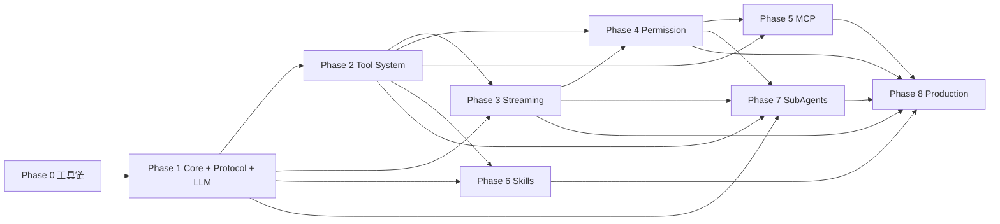

# Mini Agent Runtime 开发计划

## 0. 当前状态

Phase 0 已完成：Monorepo 边界、根级 TypeScript、ESLint、Prettier、Node Test 入口和基础目录说明已建立。当前仍未实现任何 Agent 业务能力，下一阶段为 Phase 1，需用户单独确认后才能开始。

## 1. 交付策略

目标目录结构是最终架构地图，不是一次性实现清单。按依赖从内到外交付：先建立公共协议和 Agent Loop，再接入只读 Tool，随后加入 Transport、Permission、MCP、Skills、SubAgents，最后处理 Session/Resume、Hooks、Retry、Observability 和 Sandbox。

每个 Phase 都必须通过对应 `spec.md`、`plan.md`、`tasks.md` 的验收；不提前创建空壳模块或实现后续 Phase 能力。

## 2. Phase 总览

| Phase | 负责包/应用                                         | 主要交付                                                                              | 前置依赖      | Gate                                              |
| ----- | --------------------------------------------------- | ------------------------------------------------------------------------------------- | ------------- | ------------------------------------------------- |
| 0     | 根工具链、包边界                                    | pnpm workspace、TS、apps/packages 边界、lint/format/test                              | 无            | 工具链可运行，零业务实现                          |
| 1     | `protocol`、`llm`、`agent-core`                     | Agent Loop、LLM Port、`agent-core/decision/normalizer.ts`、State、Context、基础 Event | 0             | LLMResponse 能转为 AgentDecision 并完成 Core Loop |
| 2     | `tools`                                             | `registry/`、`executor/`、`builtin/list-files`、`builtin/read-file`                   | 1             | 真实只读 Tool 受 workspace/timeout/error 边界保护 |
| 3     | `agent-core`、`protocol`、`apps/server`、`apps/web` | Event Emitter、AgentEvent Adapter、SSE、React 事件消费、重连                          | 1、2          | 端到端展示统一事件                                |
| 4     | `agent-core`、`tools`、server/web                   | Permission orchestration、approve/reject、Human-in-the-loop                           | 2、3          | 写/执行工具未批准不可产生副作用                   |
| 5     | `mcp`                                               | MCP Client、Server connection、discovery、Tool Adapter                                | 2、4          | MCP Tool 复用内部 Tool/Permission 边界            |
| 6     | `skills`、根目录 `skills/`                          | `SKILL.md` Loader、Selector、Context injection                                        | 1、2          | Skill 不扩大工具能力或权限                        |
| 7     | `subagents`                                         | 独立 Child Runtime、预算、权限、取消、结果汇总                                        | 1、2、3、4    | 父子 Run 可隔离、可取消、可追踪                   |
| 8     | `sessions`、`hooks`、`agent-core`、`tools`、server  | Session/Run/Turn、Snapshot/Resume、Retry、Hooks、Trace、Sandbox                       | 3、4、5、6、7 | 可恢复、幂等、可观测、fail-safe                   |

`search-files` 属于 Tool System 的后续增强，不是 Phase 2 初始 Gate；`write-file`、`edit-file`、`bash` 必须在 Permission/Sandbox 之后增加。

## 3. 依赖图



没有反向依赖：Phase 5 不依赖 Phase 8，Phase 8 只是整合和强化已有端口。

## 4. Phase 0 边界

Phase 0 只建立：

- `apps/web/src`、`apps/server/src`、`packages/*/src`、`tests/`、`workspace/` 的包边界约定；
- `apps/web/src/features/{chat,sessions,tools,trace}` 与 `apps/server/src/{routes,controllers,services}` 的应用层职责约定；
- `agent-core/src/{agent,decision,context,events,permissions}`、`tools/src/{registry,executor,builtin}` 的内部边界约定；
- `package.json`、`pnpm-workspace.yaml`、`tsconfig.json`、lint/format/test/typecheck 命令；
- `AGENTS.md` 和文档规则；
- 空的目录规划可以写入文档，但不创建业务模块空壳。

Phase 0 不实现 Agent、Provider、Tool、SSE 或 UI 业务。

## 5. Phase 1 精确边界

Phase 1 是第一次允许写业务代码的阶段，但只处理 Core Loop：

必须实现：

- `packages/protocol` 的 Message、ToolCall、ToolResult、AgentEvent 基础类型和唯一 ID 约定；
- `packages/agent-core/src/decision/decision.ts` 的 AgentDecision 领域类型；
- `packages/llm` 的 `LLMProvider`、`LLMResponse` Port；
- `packages/agent-core/src/decision` 的 `Decision` 类型和 `DecisionNormalizer`；
- `packages/agent-core/src/agent/agent-definition.ts` 的 AgentDefinition；
- `packages/agent-core` 的 Agent、AgentState、Context、Loop、Cancellation、最大迭代和错误收敛；
- Runtime 对 Permission、Retry、Session、Hooks 的最小编排端口，不实现其生产级实现；
- Core 级事件发布测试，不实现 SSE 或 React UI。

明确不实现：

- OpenAI/Anthropic 具体 SDK Adapter；
- 真实 Tool Executor、文件工具、MCP、Skills、SubAgents；
- SSE、WebSocket、Session Persistence、Resume、复杂 Retry、Hook Runner、Sandbox；
- React 页面和 HTTP API。

Phase 1 的输入是测试 Provider 返回的 `LLMResponse`，输出是经过 Normalizer 的 `AgentDecision` 和确定的 `AgentResult`。

## 6. Code Analysis Agent 垂直切片

这是本项目的第一条参考 Agent 应用链路，用于证明 Runtime 不只是通用编排器：

| 阶段     | 交付                                                                                                        | 明确边界                           |
| -------- | ----------------------------------------------------------------------------------------------------------- | ---------------------------------- |
| Phase 1  | 定义 `AgentDefinition`、Runtime `run(definition, input, context)` 入口                                      | 不创建具体 Agent 应用，不执行 Tool |
| Phase 2  | 在 `apps/server/src/agents/code-analysis-agent.ts` 声明 Code Analysis Agent，接入 `list-files`、`read-file` | 只读分析，不做搜索、写入或命令执行 |
| Phase 3  | 通过 Server API/SSE 和 Web UI 展示该 Agent 的完整事件链                                                     | Transport 不复制 Runtime 逻辑      |
| 后续增强 | 增加 `search-files`，完成 React 页面统计、`useEffect` 分析和报告生成                                        | 必须先更新 Tool Spec 和验收标准    |

参考任务输入：

```text
分析当前 workspace，列出代码文件，读取相关文件，并说明项目结构。
```

最终验收链路：

```text
用户输入
  -> Code Analysis Agent Definition
  -> Agent Runtime
  -> list-files / read-file
  -> Tool Results 回填 Context
  -> Agent Decision
  -> AgentEvent
  -> SSE / Web UI
  -> Final Analysis
```

该垂直切片不新增 `packages/agents`，具体 Agent 属于 `apps/server/src/agents`，通用能力仍属于 `packages/agent-core`。

## 7. 各 Phase 交付规则

每个阶段完成前必须：

1. 完整阅读相关 Spec、Plan、Tasks 和现有代码；
2. 一次只执行一个 Task；
3. 运行 Unit、Integration、Acceptance（适用时）、typecheck、lint、format check；
4. 验证行为、状态、错误和边界，而非只验证函数调用次数；
5. 更新受影响的文档、错误码、事件或任务状态；
6. 发现 Spec/架构/依赖冲突时暂停，报告问题、原因、影响和建议。

## 8. 验收策略

- Unit：包内纯逻辑和端口契约；
- Integration：跨包组合和真实临时 workspace；
- Acceptance：从用户输入到最终事件/结果的可观察链路；
- 生产能力：额外使用故障注入、重启、重复请求和安全拒绝测试。

## 9. 主要风险控制

- 目标架构过大：每个包只有在所属 Phase 才能实现；
- Provider 协议泄漏：所有模型响应必须经过 Normalizer；
- Tool 越权：唯一 Executor + Permission + Workspace guard；
- 事件耦合 SSE：AgentEvent 位于 protocol，Transport 只编码；
- Resume 重复副作用：Session 保存 Tool History/Cursor，未确认副作用 fail-safe；
- 过度工程化：不提前添加额外 package、Manager、Factory 或基础设施。
