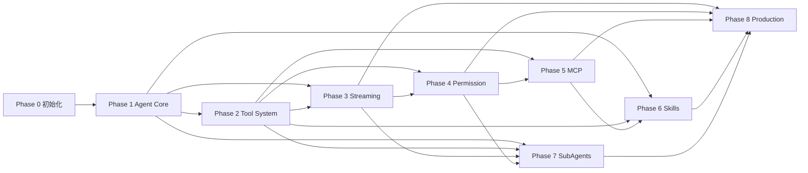

# Mini Agent Runtime 开发计划

## 1. 交付策略

采用由内到外的增量交付：先固定领域类型和 Agent Loop，再接入真实只读工具和事件传输，最后增加会改变安全和生命周期的能力。每个 Phase 有独立 Spec、Plan、Tasks、测试和人工验收，不跨阶段偷渡功能。

## 2. Phase 总览

| Phase | 名称 | 主要交付 | 前置依赖 | Gate |
|---|---|---|---|---|
| 0 | 初始化 | monorepo、TS、React/Node、lint/format/test、CI 约定 | 无 | 工具链可运行 |
| 1 | Agent Core | Message、LLM Port、State、Context、Agent Loop | 0 | 完成真实 Loop |
| 2 | Tool System | Tool、Registry、Executor、三类只读工具 | 1 | 工具结果回填并受边界约束 |
| 3 | Streaming | Agent Event、SSE API、Streaming UI、重连语义 | 1、2 | 端到端实时展示 |
| 4 | Permission | Policy、approve/reject、Human-in-the-loop | 2、3 | 写/执行默认不可绕过 |
| 5 | MCP | Client、Server contract、Tool Adapter | 2、4 | 远端工具和错误边界可见 |
| 6 | Skills | `SKILL.md`、Loader、Selector、上下文注入 | 1、2、5 | Skill 不绕过工具策略 |
| 7 | SubAgents | Delegation、隔离 Context、汇总 | 1、2、3、4 | 父子生命周期可追踪 |
| 8 | Production | Session/Resume、Retry、Hooks、Trace、Sandbox | 3、4、5、6、7 | 可恢复、可观测、受限执行 |

## 3. 依赖图



不存在反向依赖：Phase 5 不依赖 Phase 8；Phase 8 是聚合和强化阶段。

## 4. 阶段交付规则

每个阶段完成前必须：

1. 阅读对应 `spec.md`、`plan.md` 和 `tasks.md`；
2. 逐 Task 实现，单次只进行一个 Task；
3. 通过 Unit、Integration、Acceptance 测试；
4. 运行 typecheck、lint、format check；
5. 更新必要文档和 Trace/错误码；
6. 对照 Acceptance Criteria 做人工检查；
7. 发现需求或架构问题时暂停并报告“问题/原因/影响/建议”。

## 5. Phase 0 退出标准

- 项目目录与包边界已确定；
- Node/TypeScript/React 工具链可以安装、构建、测试；
- lint、format、typecheck、test 命令有稳定入口；
- 文档规则、提交规则和 SDD 工作流写入 `AGENTS.md`；
- 不包含 Agent 业务实现。

## 6. Phase 1 重点计划

Phase 1 只实现可替换 Provider 驱动的 Agent Core。Loop 先用测试 Provider 验证停止、工具决策、异常、取消和迭代上限；不实现真实文件工具、不实现 SSE、不实现写入命令和 MCP。

核心数据流：

```text
input
  -> user Message
  -> ContextBuilder
  -> LLMProvider
  -> LLMResponse
  -> final OR ToolCall decision
  -> state transition
```

Phase 1 的输出是 Tool System 可依赖的稳定端口，而不是可直接服务用户的完整产品。

## 7. 验收方式

验收以行为为中心：给定输入、Provider 决策和上下文，验证状态、消息、迭代计数、终止原因和错误事件。不能仅通过 mock 某个函数被调用来判定成功。

## 8. 风险控制

- 需求膨胀：新能力先进入后续 Spec，不修改当前 Phase 的验收范围；
- LLM 不稳定：所有 Core 行为由确定性测试 Provider 覆盖，真实 Provider 仅做 Adapter 验证；
- 安全绕过：V1 不注册写/执行工具，后续必须先有 Permission；
- 上下文增长：在 Phase 1 记录预算字段，Phase 8 再实现压缩策略；
- 事件兼容：从 Phase 3 起固定 version/eventId/sequence。
